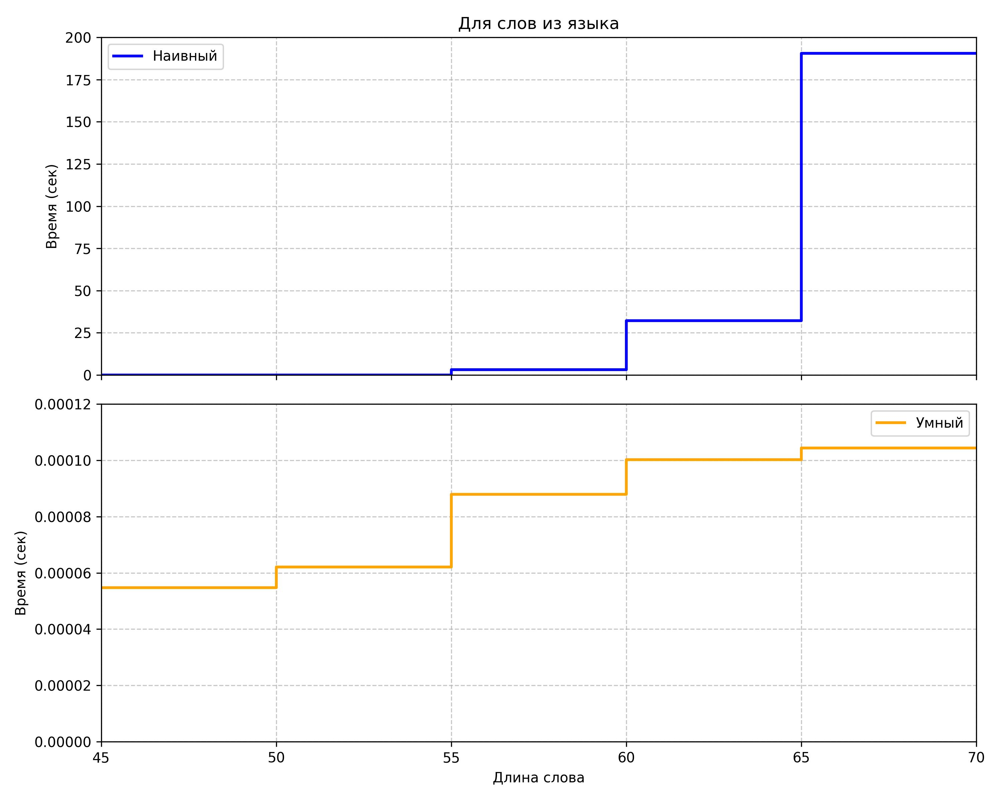
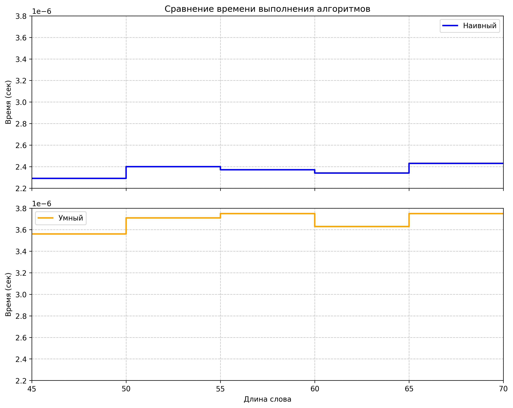

# Атрибутная грамматика 
Вариант 7
`S -> TST` ; `T1.a < T2.a`
`S -> SbS`  
`S -> aaa`
`T -> bb` ; `T1.a := 0`
`T -> TaT`; `T0.a := max(T1.a, T2.a) + 1`

# Исследование на КС
Смотрим пока ТОЛЬКО на правила `T->bb` и `T -> TaT` . Замечаем, интересную вещь. Для строки 
`bbabbabba...abb` существует дерево разбора почти-бамбук (длинная палка). Например, так:
`T` -> `bbaT` -> `bbabbaT` -> `bbabbabbaT` и так далее (каждый раз раскрываем последнюю `T`). В таком случае `T.a` будет равно числу букв "a" в слове, которое получилось при раскрытии `T`. (Или глубине раскрытия `T`)
А есть дерево разбора, когда будем последовательно заполнять каждый уровень в дереве (как в двоичной куче). Тогда `T.a` будет равно глубине раскрытия `T` , или  
`⌊log2(T#a)⌋ + 1` (Округление вниз)
Возвращаемся к исходной системе. Смотрим на первое правило и его ограничение: `S -> TST` ; `T1.a < T2.a`. С учётом вышенаписанного ограничение будет эквивалентно 
`⌊log2(T1#a)⌋ + 1 < T2#a` . Из-за логарифма язык не будет являться КС-языком.

# Написание наивного и умного парсеров
От логарифма перейдём к степеням двойки `⌊log2(T1#a)⌋ < T2#a - 1` , тогда `log2(T1#a) < T2#a - 1`, тогда `T1#a < 2 ^ (T2#a - 1)`.
Дальше избавляемся от левой рекурсии и получаем грамматику:

`S -> TSTP` ; `T1#a < 2 ^ (T2#a - 1)`
`S -> TST`  
`S -> aaaP`
`S -> aaa`
`P -> bSP`
`P -> bS`
`T -> bbQ`
`T -> bb`
`Q -> aTQ`
`Q -> aT`

В файле 1.cpp представлены наивный и умный парсер. Также тут происходит сравнение парсеров по времени работы на словах из языка и не из языка.

График для слов из языка представлен в g1.jpg

График для слов не из языка представлен в g2.jpg
